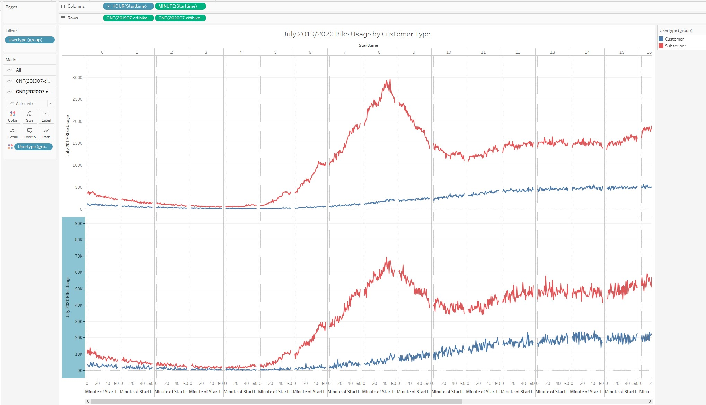
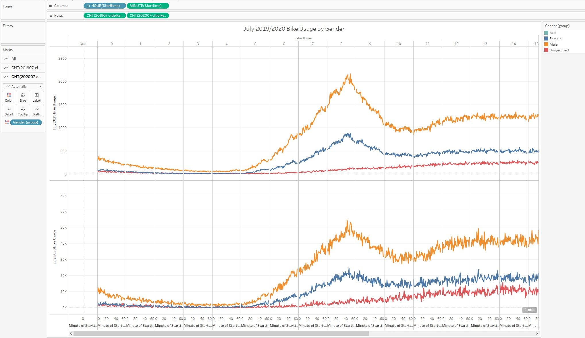
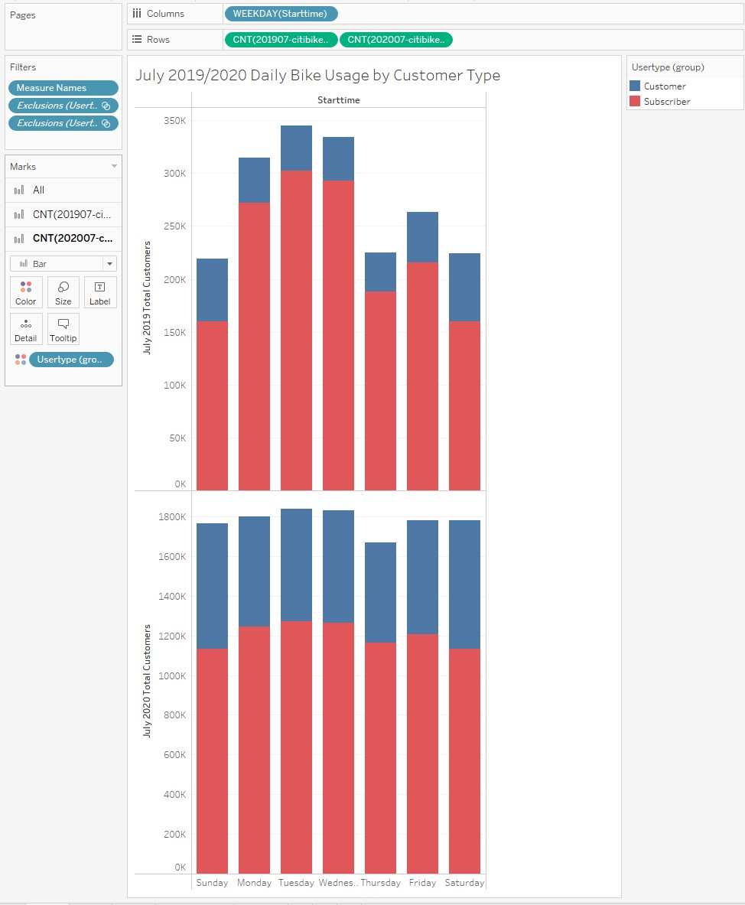
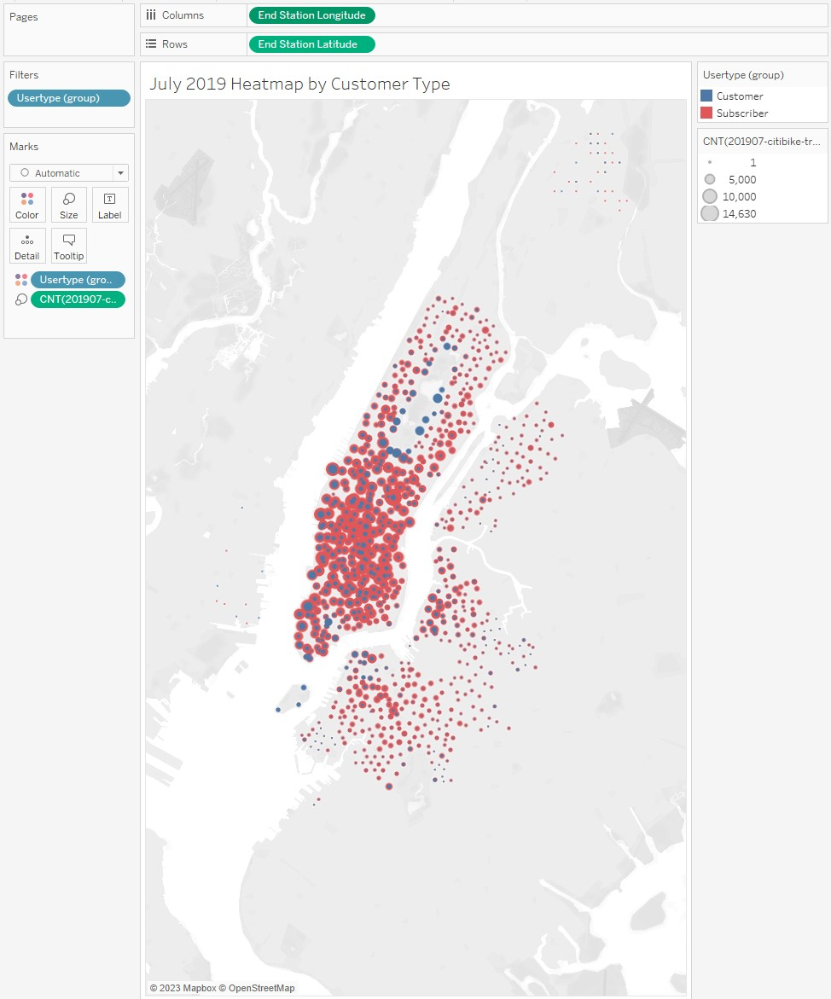
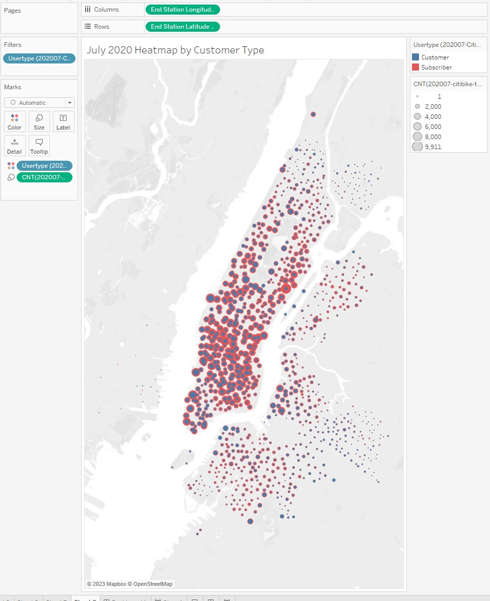
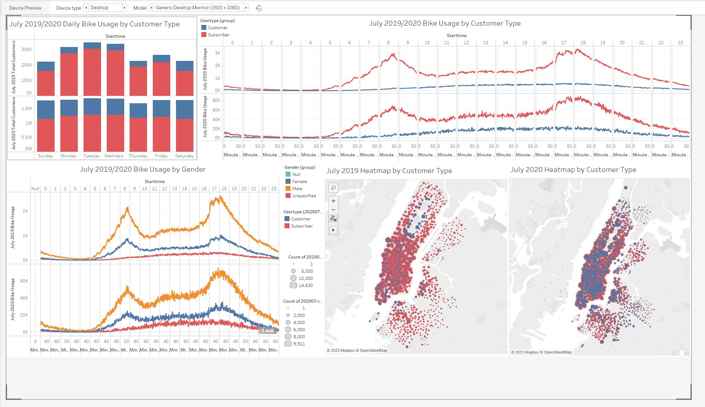
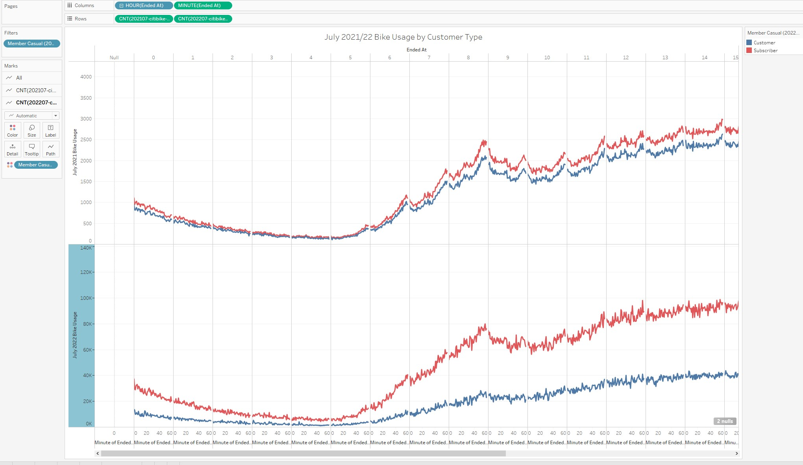
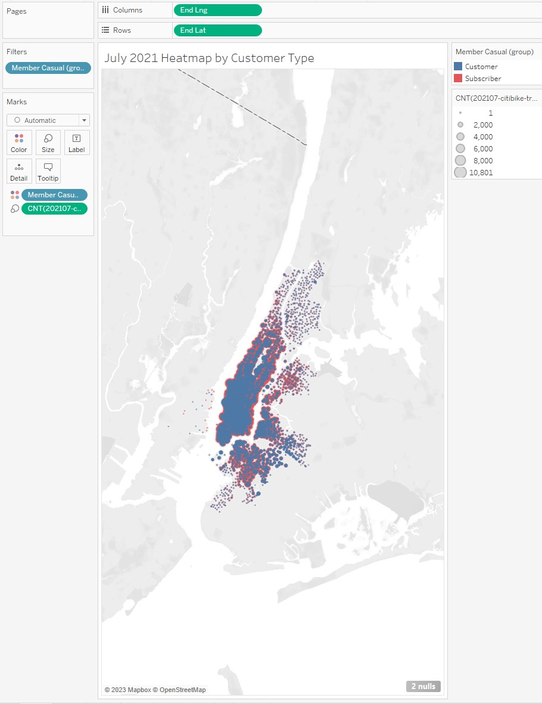
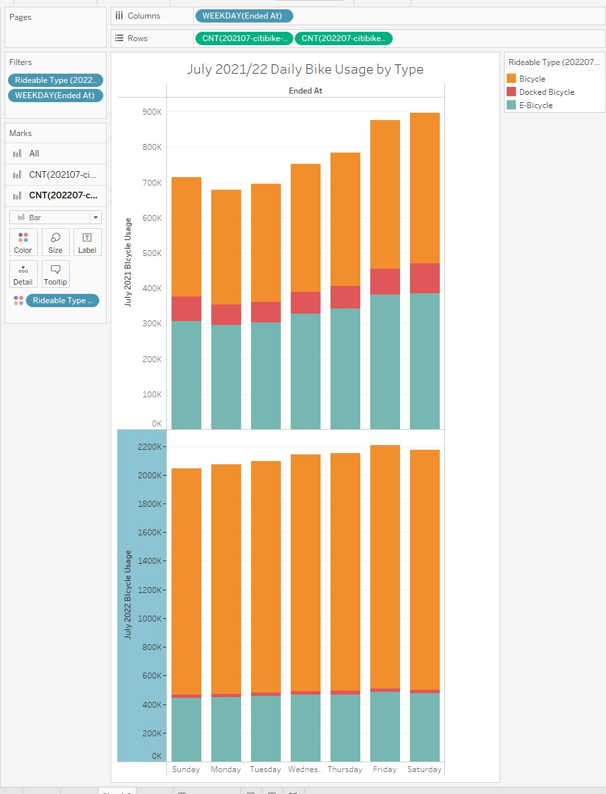
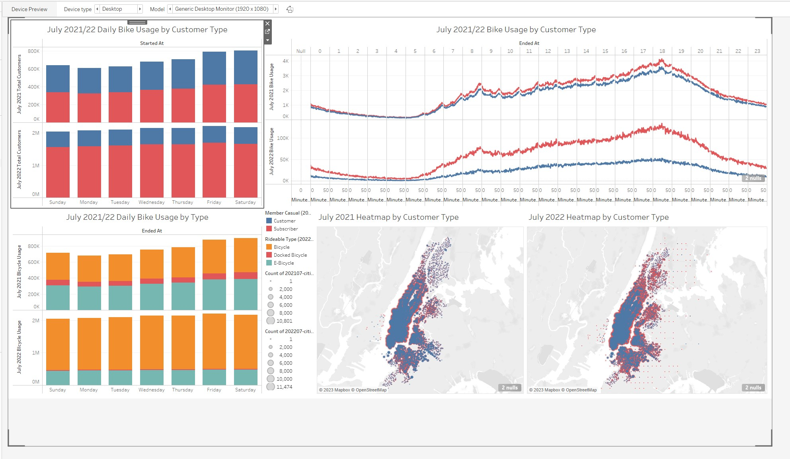

# Challenge18-CitiBike_Tableau
 CitiBike Tableau project

([Citibike Dashboard 1: ](https://public.tableau.com/app/profile/david.kramer1831/viz/2019-20book/Dashboard1?publish=yes))
([Citibike Dashboard 2: ](https://public.tableau.com/app/profile/david.kramer1831/viz/202122CitibikeDashboard2/Dashboard1?publish=yes))

NYC Citibike Dashboard Reporting for City Officials:

<b> Cleaning the Data:<b/>
The data was cleaned with Python and Tableau to ensuare that Start times, end times and tripduration were datetime objects, latitues and longitudes were geometric objects, and to remove lines with null values.

Analysis of the data:
The July data from 2019, 2020, 2021 and 2022 were used as representatives to determine the effect of the pandemic upon Citibike business.  We looked for gender differences, changes in subscriber/membership rates and changes in usage patterns and times in the available data.

1.  2019-20 Bike Usage by Customer Type
The pandemic and closures of other means of public transit drove people initially to Citibike, as noted by the marked increase in ridership
There also seemed to be less of an intense peak in ridership during rush hour
There seems to be an increase in the number of Casual riders rather than members/subscribers.  This may be due to the early shifting towards remote work models rather than the traditional in-office work models that dominated the marketplace pre-pandemic.

2.  Bike Usage by Gender
Gender rates seem to be largely unaffected by the pandemic, as the users are predominantly male.

3.  Daily Bike Usage by Customer Type.
There is a significant increase in casual rider percentages, and it seems that bike usage is evenly spread over all days of the week, rather than being concentrated on weekdays.  Possibly further indications of the remote work model being adopted.

4.  July 2019 & 2020 Heatmaps.
These show a concentration of use in Lower and Mid Manhattan, and corroborate the findings in the other visualizations

5.  Dashboard 1

6.  2021-22 Bike Usage by Customer Type
The ongoing pandemic and continued disruption of other means of public transit drove people slowed somewhat in 2021.  Continued use of hybrid and remote work models further reduced regular subscribers/members toward a more casual use of bikes, as noted by near equal values of the two memberships.
the historical peaks at rush hours with troughs between has been replaced by high usage rates throughout the day, indicating that people are using the bikes at various times throughout the day for various reasons - seemingly not only for work.
In 2022, there seems to be a shift once again towards membership/subscriptions over a casual model of use.  It remains to be seen what the future may hold as there are many factors that should be considered.

7.  2021-22 Daily Bike Usage by Customer Type
This corroborates the data seen in the other visualizations.

8. July 2019 & 2020 Heatmaps.
These show a concentration of use in Lower and Mid Manhattan, and corroborate the findings in the other visualizations

9.  July 2019 & 2020 Heatmaps.
These show a concentration of use in Lower and Mid Manhattan, Brooklyn and Queens.  It corroborates the findings in the other visualizations.

10.  Daily Bike Usage by Type
with the increased ridership again in 2022, there are very few docked bicycles, and the most used by far are traditional bikes.  E-bikes have a very flat usage rate, indicating that there is a preference for e-bikes, but that the demand outstrips their supply.  This could warrant further investigation and a detailed cost-benefit analysis as to whether they may be profitable.

11.  Dashboard 2

